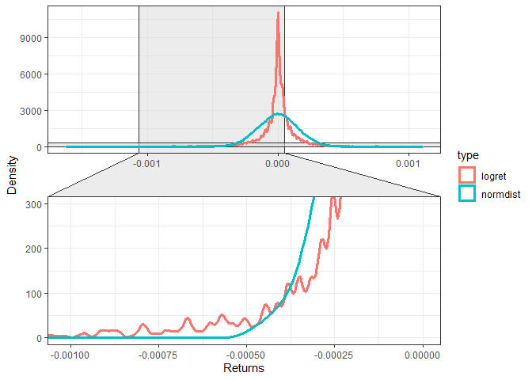
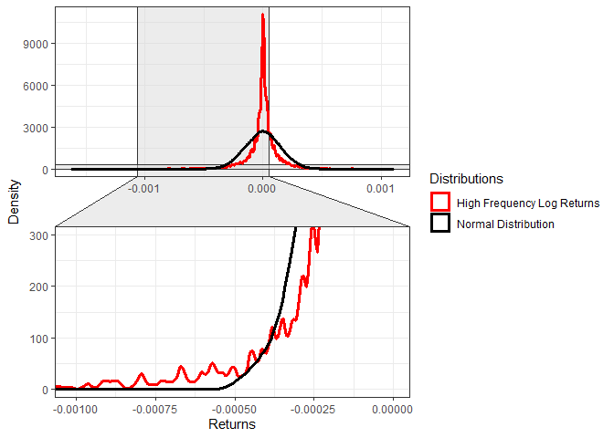

<!-- README.md is generated from README.Rmd. Please edit that file -->

# ggecon - Tidy ggplot themed plots for empirical finance and econometrics

<!-- # pkgdown -->
<!-- badges: start 
[](https://cran.r-project.org/package=pkgdown){.pkgdown-release}
[](https://github.com/r-lib/pkgdown/actions){.pkgdown-devel}
[](https://app.codecov.io/gh/r-lib/pkgdown?branch=main)
badges: end -->

ggecon opening paragraph. Learn more in `vignette("ggecon")`.

## Installation

<div class=".ggecon-devel">

``` r
# Install development version from GitHub
#install.packages("remotes")
remotes::install_github("marianapatino/ggecon")
```

</div>

## Usage

``` r
options(tidyverse.quiet = TRUE)

library(ggecon)
library(tidyverse)
library(ggplot2)
library(highfrequency)
library(xts)
library(ggforce)

quotes <- highfrequency::sampleQData %>% highfrequency::aggregateQuotes(alignBy = "seconds",alignPeriod = 5)%>% select(DT,ret = MIDQUOTE)
log_returns <- as.xts(quotes) %>% highfrequency::makeReturns()

normal_dist_logret   <- rnorm(length(log_returns),
                    mean= mean(log_returns),
                    sd = sd(log_returns))

dist1 <- log_returns %>% as.data.frame() %>% remove_rownames() %>% mutate(type = "logret")
dist2 <- normal_dist_logret %>% data.frame(ret = .) %>% mutate(type = "normdist")
```

Basic version:

``` r
compare_distributions(dist1,dist2,zoom_tail = "left") 
```

<!-- -->

Add ggplot syntax:

``` r
compare_distributions(dist1,dist2,zoom_tail = "left") +
  scale_color_manual(name = "Distributions",
                     values = c("logret" = "red",
                                "normdist" = "black"),
                     labels = c("High Frequency Log Returns","Normal Distribution"))
```

<!-- -->
